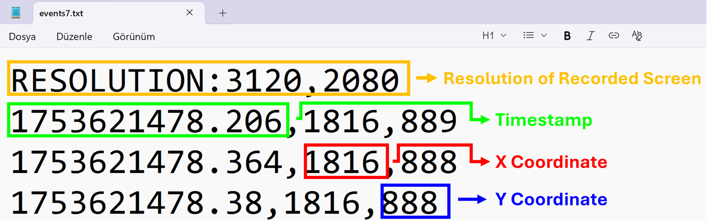

<p align="center">

</p>

# MouseEvents

MouseEvents is a Python project for recording and replaying mouse movements.  
It captures cursor positions (`x and y coordinates`) with `timestamps`, stores them in text files, and can replay them accurately.  

The project is built with the `pynput` library.


## 📌 Overview

The project consists of **two main components**:

### 🎥 Mouse Recorder
* Records mouse movements until a **left mouse button click**.  
* Saves all captured movements to a text file named f"events{a}.txt"
* Where `a` is an integer value that increments with each recording.  
* And the latest value of `a` is stored in "a_value.txt"
* Right-clicking stops the recorder immediately **without saving** the movements.  

### 💽 Mouse Replayer
* Reads a recorded `.txt` file and replays the mouse movements on the current screen.  
* Supports **automatic scaling** when replaying on different screen resolutions.  
* Includes an optional **Paint Mode**, where the program clicks during movement to draw on a canvas (e.g., MS Paint).  
* The replayer has **2 versions**:
* **Clean Version** → Simple and easy to read  
* **Error-Handled Version** → Includes exception handling (more cluttered code)

## 📊 Data Format

Example of recorded data format *(shown in the image)*:




🟨 Resolution of Recorded Screen → “This line stores the screen resolution (width × height) where the mouse movements were recorded.”

🟩 Timestamp → “The time (in seconds) since the Unix epoch (January 1, 1970, 00:00:00 UTC). (Because of time.time())”

🟥 X Coordinate → “The horizontal position of the mouse on the screen.”

🟦 Y Coordinate → “The vertical position of the mouse on the screen.”

---

## 📁 Project Structure

```text
MouseEvents/
│   a_value.txt
│   Game_to_train.sb3                  # Scratch game (Invisible Hand)
│   GeanyMouse.py                      # Recorder v1
│   GeanyMouse2.py                     # Recorder v2
│   GeanyMouse3.py                     # Recorder v3 (latest)
│   Replay_Mouse.py                    # Clean replayer
│   Replay_Mouse_with_error_handling.py# Replayer with error handling
|
├── inputs/                            # Recorded mouse events
│       events0.txt
│       events1.txt
│       ...
│       events8.txt
|
├── Demos/                             # Demonstrates basic mouse and keyboard control (e.g., hovering to specific coordinates).
│   mouseC_type.py                     # Demo controller for mouse & keyboard
│   Mouse_listener.py                  # Mouse listener demo
│   MoveMouse!.py                      # Small movement demo
│   keyboard_listener.py               # Keyboard listener demo
│
└── LSTM/                              # It's watching. It's learning.
```

---

## 🛠️ Prerequisites

* **Python:** 3.7 or higher  
* **Optional:** [Anaconda](https://www.anaconda.com/) (for easier environment management)  
* **Libraries used:**
  - `pynput` – external library (install via pip)
  - `tkinter` – standard library (GUI support; usually bundled with Python)
  - Built-in modules: `os`, `time`, `ctypes`


Install dependencies via **pip**:

```bash
pip install pynput
```

Or using **conda**:

```bash
conda create -n MouseEvents python=3.11
conda activate MouseEvents
conda install -c conda-forge pynput
```

---


## 🚀 Cross-Platform Notes

* Fully tested on **Windows 10/11**  Python 3.11  
* Uses `ctypes` for DPI-awareness (Windows only)  
* Should work on **Linux/macOS**, but not fully tested  
* `tkinter` is used to get screen size  

---

### 📖 Need help getting started?

Follow the guide to set things up step-by-step:  
➡️ [GETTING_STARTED.md](GETTING_STARTED.md)
